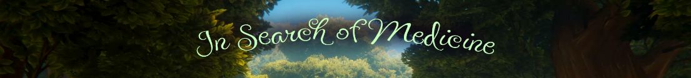

<!-- PROJECT LOGO -->
 

  

  <h3 align="center">In Search of Medicine</h3>
     
  

<!-- ABOUT THE PROJECT -->
## About The Project

  Digital collectible card game (DCCG) that 
combines the strategic gameplay of card games with the immersive 
elements of a role-playing game (RPG). Developed with inspiration from 
popular titles like Hearthstone, Legends of Runeterra, and Strange 
Horticulture, this game centers around the exciting world of medicinal plants, 
offering players an engaging experience. 

https://github.com/Candea-Marian/In-Search-of-Medicine/assets/56280373/435a407a-5074-47c8-8b3a-ab606eafdfcb

https://github.com/Candea-Marian/In-Search-of-Medicine/assets/56280373/4ea44033-3ad6-43cd-a6fd-9e7b7a4df1c2

(<a href="#readme-top">back to top</a>)

### Built With

  The project was developed using C# in the Unity game engine, 
incorporating the "CompVis - Stable Diffusion v1-4" text-to-image 
diffusion model for illustrations

* 
* 
* 
* 

